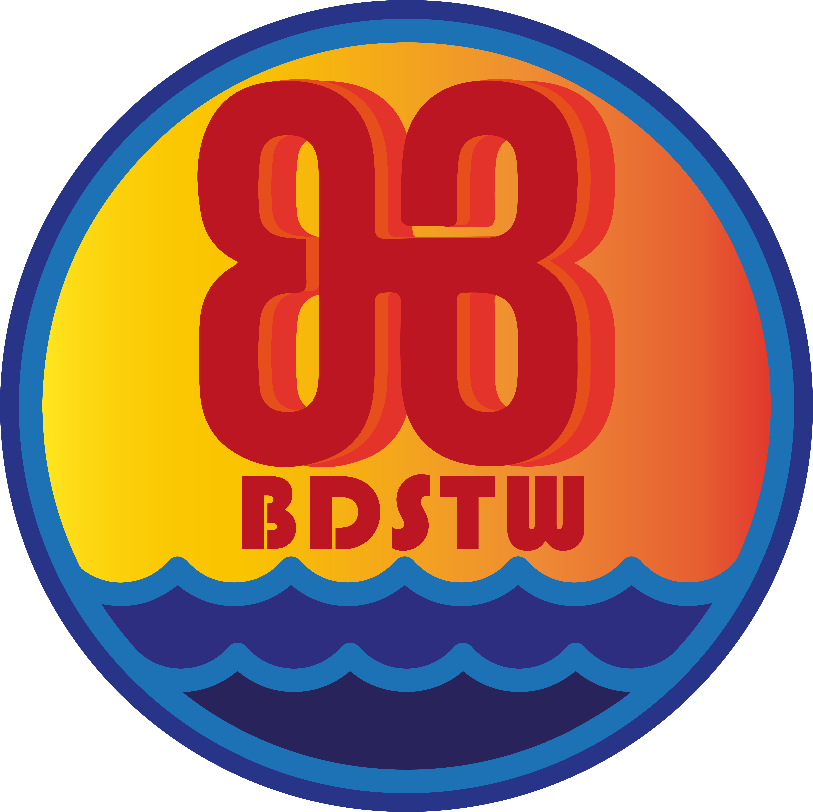

<h1 align="center">BDSTW Launcher</h1>

<em><h5 align="center">(formerly Electron Launcher)</h5></em>

[
](https://github.com/dscalzi/HeliosLauncher/actions)  

無需擔心安裝Java、Forge或其他模組，即可加入模組伺服器，我們會為您處理這些事情。

## 功能

* 🔒 完整的帳號管理。
   * 新增多個帳戶並在它們之間輕鬆切換。
   * 完全支援 Microsoft (OAuth 2.0) + Mojang (Yggdrasil) 身份驗證。
   * 憑證絕不會直接儲存並傳輸到 Mojang。
 * 📂 高效率的資產管理。
   * 一旦我們發布啟動器更新，就立即接收它們。
   * 文件在啟動前經過驗證。 將重新下載損壞或不正確的檔案。
 * ☕ **自動 Java 驗證。**
   * 如果您安裝了不相容的 Java 版本，我們將*為您*安裝正確的版本。
   * 您無需安裝 Java 即可執行啟動器。
 * 📰 公告源原生內建於啟動器中。
 * ⚙️ 直覺的設定管理，包括 Java 控制台。
 * 支援我們所有的伺服器。
   * 輕鬆切換伺服器配置。
   * 查看所選伺服器的玩家數量。
 * 自動更新。 沒錯，啟動器會自行更新。
 * 查看Mojang服務的狀態。

 這不是一份詳盡的清單。 下載並安裝啟動器來查看它的所有功能！